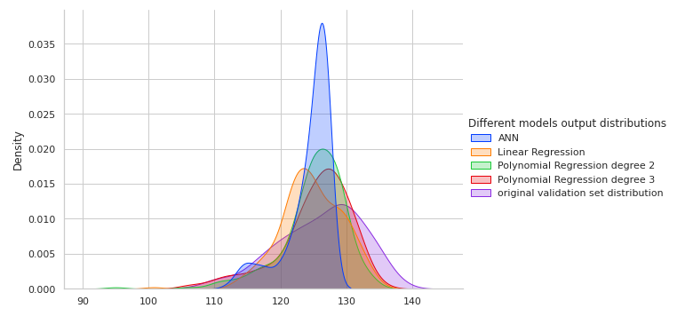

The data used for simulation was extracted from : 
https://archive.ics.uci.edu/ml/datasets/Airfoil+Self-Noise
The jupyter notebook "Dataprocessing.ipynb" presents the pipeline that was made to clean the data received from the ML repo.

the second notebook presents the approach followed to model Airfoils self noise. It covers all steps from data processing to modeling. The analysis was sumed up in the following graph that indicates polynomial regression dergree 3 as the best model. This graph show some density distributions produced by regression models, compares them to the original validation data distribution.

The X axis presents the range of values of different airfoil noises sound pressure.

